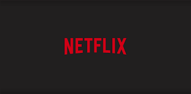
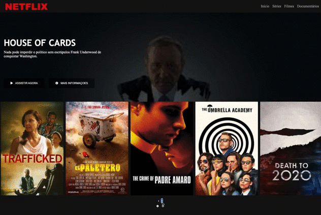

  
  # netflix-clone
  
Neste projeto foi feito um clone da interface do site da NETFLIX utilizando as tecnologias HTML5, CSS3, e javaScript.

---

  <footer>
      <small>© 2021 Jair Neto. All rights reserved.
  
                            
  

  
  
  
  
  
  

